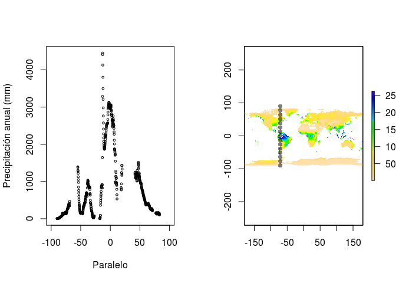
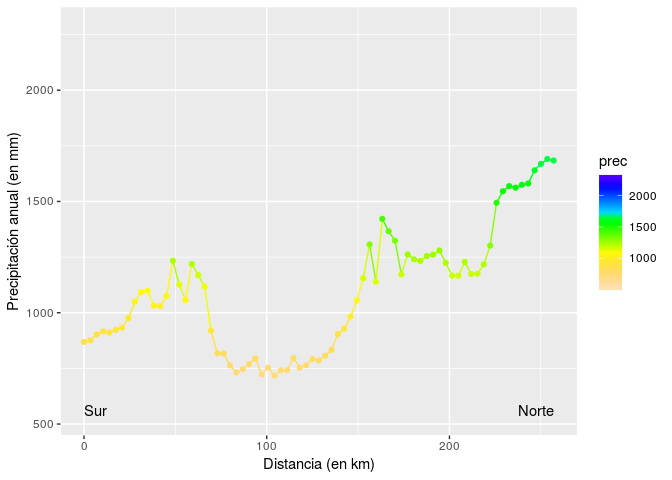

<!-- Este .md fue generado a partir del .Rmd homónimo. Edítese el .Rmd -->
Contexto físico: la "plantilla" geográfica
==========================================

La idea es que uses las referencias para "intentar" aprender sobre los condicionamientos físicos que intervienen en la distribución de especies. **Escribe tus respuestas a los mandatos en el archivo `README.Rmd`**. Ejecuta tu código en la consola antes de tejer. Teje al finalizar, pero no olvides guardar en la medida que escribes.

Tus referencias serán los capítulos 3 a 5 de T. M. Smith & Smith (2007) y el capítulo 3 de Lomolino, Riddle, Brown, & Brown (2006). Alternativamente, puedes consultar la versión resumida de este tema que se encuentra en [este vídeo de YouTube](https://www.youtube.com/watch?v=R8m_EmZsxJU), así como en [esta presentación de diapositivas](https://drive.google.com/file/d/1-3os3Y9b6V2IkPhMUTYtbvIQag7dfeIL/view?usp=sharing).

> En esta asignación, verás que algunas preguntas requieren que escribas tu respuesta usando un número específico de caracteres. Puedes consultar el número de caracteres de una línea determinada en RStudio, usando la barra inferior de este documento. Allí verás un área tal que ésta . En este ejemplo, el cursor se encuentra en la línea 15, caracter 175.

Preguntas/mandatos. Responde según las referencias señaladas arriba. En caso de que prefieras usar otras referencias, indícalas.
--------------------------------------------------------------------------------------------------------------------------------

-   ¿Cuáles son las principales variables climáticas que determinan la distribución de la vegetación terrestre?

    Tu respuesta, aquí: ...

-   Si 100 unidades de radiación solar alcanzan el tope de la atmósfera, ¿Por qué el planeta emite 147 unidades?

    Tu respuesta, aquí: ...

-   En cuanto a emisividad, la Tierra y el Sol se comportan como cuerpos negros, ¿Por qué?

    Tu respuesta, aquí: ...

-   Cada quien tiene asignado un valor de temperatura de cuerpo negro en grados Kelvin. Usa el recuadro "Cuantificando la ecología 3.1" de T. M. Smith & Smith (2007). ¿Cuánta energía radiante emite el cuerpo?

        ##                  temperatura
        ## AbigailCP                938
        ## BidelkisCastillo         596
        ## dahianagb07             3353
        ## emdilone                 421
        ## enrique193               794
        ## jimenezsosa             2692
        ## Jorge-Mutonen           1521
        ## JuanJoseGH06            1753
        ## Mangoland               3245
        ## maritzafg               4373
        ## yanderlin               4128

    Tu respuesta, aquí: ...

-   Usando el mismo recuadro y el mismo valor de temperatura, ¿En qué longitud de onda emite dicho cuerpo más radiación electromagnética?

    Tu respuesta, aquí: ...

-   ¿En dos palabras, que es la PAR?

    Tu respuesta, aquí: ...

-   Define el espectro electromagnético, pero con tus propias palabras.

    Tu respuesta, aquí: ...

-   Explica, con tus palabras, en 200 caracteres o menos, el mecanismo por el cual varía la radiación solar que llega a la superficie de la Tierra en las diferentes latitudes.

    Tu respuesta, aquí: ...

-   Explica, con tus palabras y en 200 caracteres o menos, ¿Por qué la radiación solar interceptada varía según las estaciones?

    Tu respuesta, aquí: ...

-   Genera un gráfico de temperatura promedio anual continental en un gradiente latitudinal, desde el Polo Sur al Norte, a lo largo del meridiano que se te asigna aleatoriamente a continuación y utilizando la serie de datos [WorldClim, versión 2]((http://worldclim.org/version2)) (Fick & Hijmans, 2017).

        ##                  meridiano
        ## AbigailCP             -125
        ## BidelkisCastillo      -145
        ## dahianagb07             21
        ## emdilone              -156
        ## enrique193            -134
        ## jimenezsosa            -19
        ## Jorge-Mutonen          -90
        ## JuanJoseGH06           -76
        ## Mangoland               14
        ## maritzafg               82
        ## yanderlin               68

    Fíjate en el siguiente ejemplo, donde se genera el gradiente térmico latitudinal continental del meridiano -71 grados (longitud negativa al oeste del meridiano central; si fuese, positiva estaría al este).

    ``` r
    NSt(-71)
    ```

    

    Ahora cambia el meridiano -71 por el tuyo, ejecuta la línea de código en la consola, observa la salida e **interpreta el resultado** (cómo y por qué cambia la temperatura respecto de la latitud, por qué hay cambios bruscos en el gradiente, por qué hay vacíos de información):

    Tu respuesta, aquí: ...

-   ¿Por qué disminuye la temperatura del aire con la altitud?

    Tu respuesta, aquí: ...

-   ¿Qué produce el efecto Coriolis sobre la circulación de las masas de aire?

    Tu respuesta, aquí: ...

-   Describe las "células", frentes y depresiones de las masas de aire (circulación general atmosférica), qué efectos tienen sobre las corrientes, y explica por qué los alisios soplan desde el Este.

    Tu respuesta, aquí: ...

-   ¿Qué es la humedad relativa? Opina también cómo ésta podría afectar a la distribución de especies.

    Tu respuesta, aquí: ...

-   Explica por qué se registran precipitaciones tan elevadas en la ZCIT.

    Tu respuesta, aquí: ...

-   ¿Qué ocurre en torno a la latitud 30° (Norte y Sur) que provoca una disminución relativa de las precipitaciones?

    Tu respuesta, aquí: ...

-   Genera un gráfico de precipitación anual continental en un gradiente latitudinal, desde el Polo Sur al Norte, a lo largo del meridiano que se te asignó arriba aleatoriamente y utilizando la serie de datos [WorldClim, versión 2]((http://worldclim.org/version2)) (Fick & Hijmans, 2017).

    Fíjate en el siguiente ejemplo, donde se genera el gradiente pluviométrico latitudinal continental del meridiano -71 grados (longitud negativa, al oeste del meridiano central; si fuese, positiva estaría al este).

    ``` r
    NSp(-71)
    ```

    

    Ahora cambia el meridiano -71 por el tuyo, ejecuta la línea de código en la consola, observa la salida e **interpreta el resultado** (cómo y por qué cambia la precipitación respecto de la latitud, por qué hay cambios bruscos en el gradiente, por qué hay vacíos de información):

    Tu respuesta, aquí: ...

-   Con tus palabras, y en menos de 150 caracteres, ¿qué es sombre de lluvia?

    Tu respuesta, aquí: ...

-   Genera un gráfico de precipitación anual de RD a lo largo de un transecto Norte-Sur elegido para ti, utilizando la serie de datos [WorldClim, versión 2]((http://worldclim.org/version2)) (Fick & Hijmans, 2017).

        ##                  transecto
        ## AbigailCP               31
        ## BidelkisCastillo        20
        ## dahianagb07            112
        ## emdilone                14
        ## enrique193              27
        ## jimenezsosa             90
        ## Jorge-Mutonen           51
        ## JuanJoseGH06            59
        ## Mangoland              108
        ## maritzafg              146
        ## yanderlin              138

    Fíjate en el siguiente ejemplo, donde se genera un transecto de precipitación Norte-Sur para el transecto `1`.

    ``` r
    RDp(1)
    ```

    

    Ahora cambia el transecto `1` por el tuyo, teje tu RMarkdown (`CTRL+SHIFT+K`), observa la salida e **interpreta el resultado** (cómo y por qué cambia la precipitación a lo largo del transecto, por qué hay lugares con menor/mayor precipitación que otros, qué factores influyen):

    Tu respuesta, aquí: ...

-   Describe dos variaciones irregulares del clima a escala regional

    Tu respuesta, aquí: ...

-   Describe dos variaciones irregulares del clima a escala regional

    Tu respuesta, aquí: ...

-   Pon dos ejemplos de organismos que conozcas que habiten en condiciones locales y describe en qué consisten dichas condiciones.

    Tu respuesta, aquí: ...

-   Describe las características típicas del ambiente urbano.

    Tu respuesta, aquí: ...

-   Con menos de 300 caracteres, describe los principales "trayectos" del movimiento del agua en el "ciclo hidrológico".

    Tu respuesta, aquí: ...

-   ¿Por qué son importantes la tensión superficial y la viscosidad del agua para determinados organismos?

    Tu respuesta, aquí: ...

-   ¿A qué profundidad en agua pura la intensidad relativa aproximada del rojo es máxima? ¿Y de azul?

    Tu respuesta, aquí: ...

-   La termoclina es una región que separa dos capas teóricas del perfil vertical de profundidad de masas de agua. Nómbralas y descríbelas.

    Tu respuesta, aquí: ...

-   Considera la termoclina de un lago estacional (preferiblemente, de latitud subtropical): ¿En qué estación es más marcada y profunda? ¿Cuándo es más somera? ¿Cuándo se atenúa?

    Tu respuesta, aquí: ...

-   ¿Cuáles son los principales elementos presentes en el agua de mar (forman el 99% de la sal marina)? ¿Cuáles son los dos dominantes? ¿A qué equivale una unidad práctica (funcional) de salinidad? Escribe la salinidad del mar abierto y del agua dulce en ‰

    Tu respuesta, aquí: ...

-   ¿Cuáles son los factores que controlan la difusión de oxígeno en el agua? Describe el perfil típico del oxígeno en el océano.

    Tu respuesta, aquí: ...

-   ¿Por qué es importante el pH del agua para los organismos? ¿Qué repercursiones tiene en República Dominicana? Para apoyar tus ideas, consulta este mapa, aleja el zoom y examina el país de un vistazo. Puedes usar la herramienta de "información"  y hacer clic sobre alguna roca para ver su descripción. Las manchas con trama de ladrillo representan calizas; hay otras rocas carbonatadas, además de las calizas. Adicionalmente, lee el resumen de [este artículo](https://www.nature.com/articles/s41598-019-44440-8) y consulta la crítica al respecto.

    Tu respuesta, aquí: ...

-   P

    Tu respuesta, aquí: ...

-   P

    Tu respuesta, aquí: ...

-   P

    Tu respuesta, aquí: ...

-   P

    Tu respuesta, aquí: ...

-   P

    Tu respuesta, aquí: ...

-   P

    Tu respuesta, aquí: ...

Referencias
===========

Fick, S. E., & Hijmans, R. J. (2017). WorldClim 2: New 1-km spatial resolution climate surfaces for global land areas. *International Journal of Climatology*, *37*(12), 4302–4315.

Lomolino, M. V., Riddle, B. R., Brown, J. H., & Brown, J. H. (2006). *Biogeography*. Sinauer Associates Sunderland, MA.

Smith, T. M., & Smith, R. L. (2007). *Ecología*. Pearson Educación.
