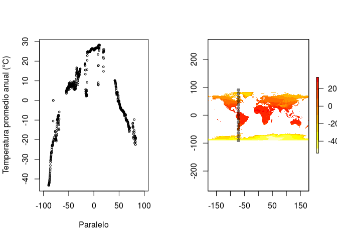

<!-- Este .md fue generado a partir del .Rmd homónimo. Edítese el .Rmd -->
Contexto físico: la "plantilla" geográfica
==========================================

La idea es que uses las referencias para "intentar" aprender sobre qué condicionamientos físicos actúan en la distribución de especies. **Escribe tus respuestas a los mandatos en el archivo `README.Rmd`**. Teje al finalizar, pero no olvides guardar en la medida que escribes.

Tus referencias serán los capítulos 3 a 5 de T. M. Smith & Smith (2007) y el capítulo 3 de Lomolino, Riddle, Brown, & Brown (2006). Alternativamente, puedes consultar la versión resumida de este tema que se encuentra en [este vídeo de YouTube](https://www.youtube.com/watch?v=R8m_EmZsxJU), así como en [esta presentación de diapositivas](https://drive.google.com/file/d/1-3os3Y9b6V2IkPhMUTYtbvIQag7dfeIL/view?usp=sharing).

> En esta asignación, verás que algunas preguntas requieren que escribas tu respuesta usando un número específico de caracteres. Puedes consultar el número de caracteres de una línea en RStudio, usando la barra inferior de este documento. Allí verás este cuadro ; el ejemplo indica que en la línea 15 hay 175 caracteres (no uses `<enter>` para separar líneas).

Preguntas/mandatos. Responde según las referencias señaladas arriba. En caso de que prefieras usar otras referencias, indícalas.
--------------------------------------------------------------------------------------------------------------------------------

-   ¿Cuáles son las principales variables climáticas que determinan la distribución de la vegetación terrestre?

    Tu respuesta, aquí: ...

-   Si 100 unidades de radiación solar alcanzan el tope de la atmósfera, ¿Por qué el planeta emite 147 unidades?

    Tu respuesta, aquí: ...

-   En cuanto a emisividad, la Tierra y el Sol se comportan como cuerpos negros, ¿Por qué?

    Tu respuesta, aquí: ...

-   Cada quien tiene asignado un valor de temperatura de cuerpo negro en grados Kelvin. Usa el recuadro "Cuantificando la ecología 3.1" de T. M. Smith & Smith (2007). ¿Cuánta energía radiante emite el cuerpo?

        ##                  temperatura
        ## AbigailCP                938
        ## BidelkisCastillo         596
        ## dahianagb07             3353
        ## emdilone                 421
        ## enrique193               794
        ## jimenezsosa             2692
        ## Jorge-Mutonen           1521
        ## JuanJoseGH06            1753
        ## Mangoland               3245
        ## maritzafg               4373
        ## yanderlin               4128

    Tu respuesta, aquí: ...

-   Usando el mismo recuadro y el mismo valor de temperatura, ¿En qué longitud de onda emite dicho cuerpo más radiación electromagnética?

    Tu respuesta, aquí: ...

-   ¿En dos palabras, que es la PAR?

    Tu respuesta, aquí: ...

-   Define el espectro electromagnético, pero con tus propias palabras.

    Tu respuesta, aquí: ...

-   Explica, con tus palabras, en 200 caracteres o menos, el mecanismo por el cual varía la radiación solar que llega a la superficie de la Tierra en las diferentes latitudes.

    Tu respuesta, aquí: ...

-   Explica, con tus palabras y en 200 caracteres o menos, ¿Por qué la radiación solar interceptada varía según las estaciones?

    Tu respuesta, aquí: ...

-   Genera un gráfico de temperatura promedio anual en un gradiente latitudinal, desde el Polo Sur al Norte, a lo largo del meridiano que se te asigna aleatoriamente y utilizando la serie de datos [WorldClim, versión 2]((http://worldclim.org/version2)) (Fick & Hijmans, 2017). **Interpreta el resultado** (cómo y por qué cambia la temperatura respecto de la latitud, por qué hay cambios bruscos en el gradiente):

        ##                  meridiano
        ## AbigailCP             -125
        ## BidelkisCastillo      -145
        ## dahianagb07             21
        ## emdilone              -156
        ## enrique193            -134
        ## jimenezsosa            -19
        ## Jorge-Mutonen          -90
        ## JuanJoseGH06           -76
        ## Mangoland               14
        ## maritzafg               82
        ## yanderlin               68

    ``` r
    #En el siguiente ejemplo, se genera el gradiente latitudinal del
    #meridiano 71 grados oeste (valores negativos al oeste del meridiano
    #central; positivos al este. Cambia el valor y genera tu gráfico.
    NSt(-71)
    ```

    

    Tu respuesta, aquí: ...

Referencias
===========

Fick, S. E., & Hijmans, R. J. (2017). WorldClim 2: New 1-km spatial resolution climate surfaces for global land areas. *International Journal of Climatology*, *37*(12), 4302–4315.

Lomolino, M. V., Riddle, B. R., Brown, J. H., & Brown, J. H. (2006). *Biogeography*. Sinauer Associates Sunderland, MA.

Smith, T. M., & Smith, R. L. (2007). *Ecología*. Pearson Educación.
